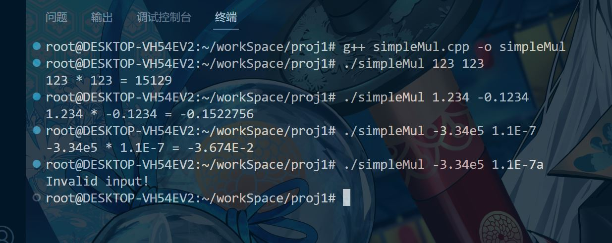

# CS205 C/ C++ Programming - Project 1 A Simple Calculator
**Name:** Lv Yue  
**SID:** 11710420

## Part1: Analysis  
Project goal: Implement a calculator which can multiply two numbers.  
Using C++ * operator is easy to implement the perpose.  
However, to avoid overflow of basic type or precision loss of floating point number, we choose to simulate basic handwritten vertical multiplication, time complexity O(n^2).
Further more, there is Karatsuba algorithm, which core idea is *divide and conquer*. Its time complexity can reduce to O(n^log<sub>2</sub>3).  

## Part2: Core code
The **native multiplier**: 
```C++
/// @brief mul two input bit by bit to aviod data loss
/// @param array1: char[], input in char[] form
/// @param array2: char[], input in char[] form
/// @return ret: string, could it start with '.'? no
string hugeMul(char *array1, char *array2) {
  char res[strlen(array1) + strlen(array2)] = {0};
  for (int i = strlen(array1) - 1; i >= 0; i--) {
    for (int l = strlen(array2) - 1; l >= 0; l--) {
      // -'0' converts char to number in real
      // by minus/add '0's ascii so we can caculate directly
      res[i + l + 1] += (array1[i] - '0') * (array2[l] - '0');
      res[i + l] += res[i + l + 1] / 10;
      res[i + l + 1] %= 10;
    }
  }
  char retP[sizeof(res)] = {0};
  for (int i = 0; i < sizeof(res); i++) {
    retP[i] = res[i] + '0';
  }
  // hint: use string ret(retP) directly could possiblely include the '\n', and
  // will ruin the decimal point position calculation.
  string ret = "";
  for (int i = 0; i < sizeof(retP); i++) {
    // use push_back() to avoid the hint
    ret.push_back(retP[i]);
  }
  while (ret[0] == '0') {
    ret.erase(0, 1);
  }
  return ret;
}
```
<br>

... and the ***Karatsuba multiplier***: 
```C++
/// @brief Karatsuba algorithm, inspired by the article
/// https://www.geeksforgeeks.org/karatsuba-algorithm-for-fast-multiplication-using-divide-and-conquer-algorithm/
/// @param str1
/// @param str2
/// @return string
string karatsuba(string str1, string str2) {
  int len = addZeros(str1, str2);

  if (len == 1) {
    return to_string(atoi(str1.c_str()) * atoi(str2.c_str()));
  }

  int subLen = len / 2;
  string a = str1.substr(0, subLen);
  string b = str1.substr(subLen, len - subLen);
  string c = str2.substr(0, subLen);
  string d = str2.substr(subLen, len - subLen);

  string ac = karatsuba(a, c);
  string bd = karatsuba(b, d);
  // string acPbd = strAdd(ac, bd);
  // string adPbc = strAdd(karatsuba(a, d), karatsuba(b, c));
  string aPbcPd = karatsuba(strAdd(a, b), strAdd(c, d));
  string adPbc = strMinus(aPbcPd, strAdd(ac, bd));

  int bitShift = len - subLen;
  for (int i = 0; i < bitShift * 2; i++) {
    ac = ac + '0';
  }
  for (int i = 0; i < bitShift; i++) {
    adPbc = adPbc + '0';
  }

  return strAdd(strAdd(ac, adPbc), bd);
}
```

## Part 3: Result & Verification


## Part 4 - Difficulties & Solutions
1. C++ `char[]` sometime automaticly add an `'\n'` as end character. After bit calculate and convert `char[]` to `string` could possibly add extra unexpected characters at the end.  
2. Use `std::string str(char *)` method directly could possiblely include the `'\n'`, and will ruin the decimal point position calculation.   
3. For the string type, the add and minus methods need to be rewritten into `strAdd(string str1, string str2)` and `strAdd(string str1, string str2)` to meet the needs of bitwise operations.   
4. In order to meet the needs of Karatsuba algorithm, the function `addZero(string str1, string str2)` is responsible for filling the digits of the two multipliers.  
5. Input validity checks are scattered in the `inputHandle(string str)` and `str2charl(string str)` functions. The output is also spliced from multiple objects as follow:
```C++
// format output
  cout << str1 << " * " << str2 << " = ";
  if (isNegative) {
    cout << '-';
  }
  cout << resHead;
  if (resTail) {
    cout << 'E' << resTail;
  }
  cout << endl;
  /// @todo: combine the result into one object to store/transmit/reuse
  return 0;
  ```
  6. C++ does not allow functions to directly return multiple objects. However, preprocessing requires dividing the input into multiple parts. In this project, I chose to use `tuple` to achieve this.
  ```C++
  /// @brief Input early check + preprocessing
/// @param str: string, main() argv[1] or argv[2]
/// @return tuple<char *arrayHead, int arrayTail, int pLocation, bool
/// isNegative>
///   @retval arrayHead: the decimal part
///   @retval arrayTail: ths power part
///   @retval pLocation: decimal point position
///   @retval isNegative: the parity
tuple<char *, int, int, bool> inputHandle(string str) {
  bool isNegative = 0;

  ...

  char *arrayHead = new char(0);
  int arrayTail = 0;
  int pLocation = 0;
  ...

  tuple<char *, int, int, bool> ret =
      make_tuple(arrayHead, arrayTail, pLocation, isNegative);
  return ret;
}